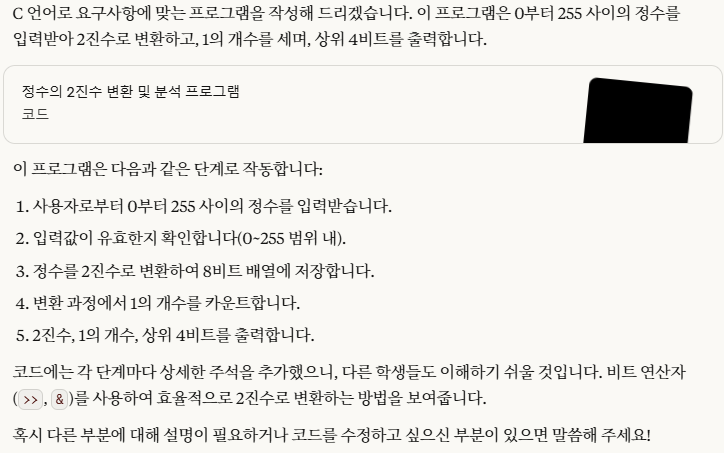

# 📖 0404 실습 과제

## 🏷️ 과제 내용

✅ 생성형 AI를 이용하여 다음의 프로그램의 코드를 작성하시오. <br>
### ⌨️ 입력
- **0부터 255사이의 정수**가 주어진다.
### 🖥️ 출력
- 다음의 값을 예제와 같은 형태로 출력한다.
  - 주어진 정수를 2진수로 출력
  - 1의 개수가 무엇인지 출력
  - 8비트 중에 상위 4비트를 출력

### ❔ 예제 입력
```bash
0부터 255 사이의 정수 입력 : 94
```
### ❕ 예제 출력
```bash
2진수 : 01011110
1의 개수 : 5
상위 4비트 : 0101
```
---
### ⌨️ 생성형 AI의 프롬프트
✅ claude.ai를 활용

```bash
너는 c 프로그래밍을 배우는 대학생이야. 다음의 내용에 맞는 코드를 c언어로 작성해줘.
 
입력 : 0부터 255사이의 정수가 주어진다.
출력 : 다음의 값을 예제와 같은 형태로 출력한다.
  - 주어진 정수를 2진수로 출력
  - 1의 개수가 무엇인지 출력
  - 8비트 중에 상위 4비트를 출력
예제 입력
0부터 255 사이의 정수 입력 : 94
예제 출력
2진수 : 01011110
1의 개수 : 5
상위 4비트 : 0101

저번 수업의 과제를 위해 이 코드를 짜고자 해. 코드에 다른 학생들도 쉽게 이해할 수 있도록 구체적으로 주석 작성해줘.
```

### 🖥️ 생성형 AI의 출력



### ✅ 결과 코드
```c
#include <stdio.h>

int main() {
    int num;         // 사용자로부터 입력받을 정수
    int binary[8];   // 2진수 변환 결과를 저장할 배열 (8비트)
    int count = 0;   // 1의 개수를 카운트할 변수

    // 사용자로부터 0~255 사이의 정수 입력받기
    printf("0부터 255 사이의 정수 입력 : ");
    scanf("%d", &num);

    // 입력값 범위 확인 (0~255)
    if (num < 0 || num > 255) {
        printf("오류: 0부터 255 사이의 정수를 입력해주세요.\n");
        return 1;  // 프로그램 비정상 종료
    }

    // 입력된 정수를 2진수로 변환
    // 8비트(0~7) 배열에 각 비트 저장 (binary[0]이 최상위 비트)
    for (int i = 7; i >= 0; i--) {
        // 2^i 위치의 비트가 1인지 확인
        binary[7 - i] = (num >> i) & 1;

        // 1의 개수 카운트
        if (binary[7 - i] == 1) {
            count++;
        }
    }

    // 2진수 출력
    printf("2진수 : ");
    for (int i = 0; i < 8; i++) {
        printf("%d", binary[i]);
    }
    printf("\n");

    // 1의 개수 출력
    printf("1의 개수 : %d\n", count);

    // 상위 4비트 출력 (배열의 첫 4개 원소)
    printf("상위 4비트 : ");
    for (int i = 0; i < 4; i++) {
        printf("%d", binary[i]);
    }
    printf("\n");

    return 0;  // 프로그램 정상 종료
}
```
